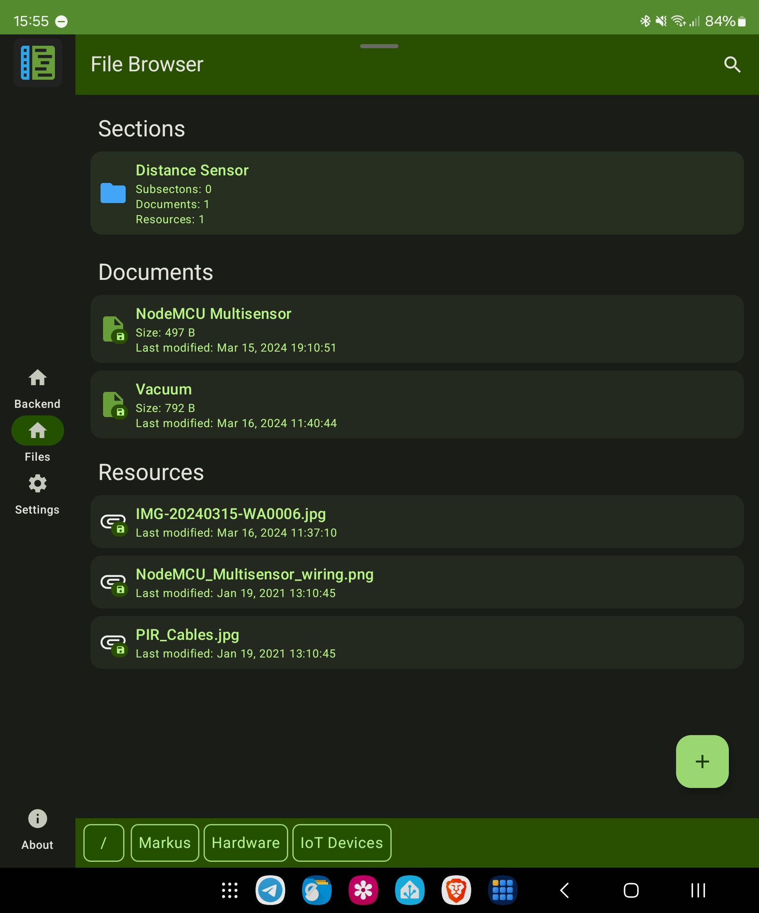

    

# MkDocsEditor

A realtime collaborative editor for MkDocs projects.

# :warning: Work In Progress

This project is still a work in progress and is **not yet ready for production**.

# What is this?

MkDocsEditor aims to provide an easy way for you to manage your existing [MkDocs](https://www.mkdocs.org/) projects:
* [ ] Section management (folders)
  * [x] create sections
  * [x] rename sections
  * [ ] move an entire section to another location
  * [x] delete a section and all the content inside it
* [ ] Document management (`*.md` files)
  * [x] create documents
  * [x] rename documents
  * [x] edit documents in realtime
  * [x] see the result on your hosted website right away
  * [ ] move a document
    * [ ] move all resources that are referenced in it, if possible
  * [x] delete documents
    * [ ] delete unused resources that are referenced in it
* [ ] Resource file management (any file that is not a markdown file really)
  * [x] upload resource files
  * [x] download linked resources
  * [x] open/share linked resources (if supported by another app on your device)
  * [x] delete resource files
    * [ ] automatically replace any reference to this resource in a document with a "deleted" note
* [x] Search
* [x] Full Offline Cache

## Realtime collaborative editing

MkDocsEditor is built around the famous [Differential Synchronization](https://neil.fraser.name/writing/sync/)
algorithm developed by [Neil Fraser](https://neil.fraser.name/) which allows
you to edit a document simultaniously while someone else is also editing.

**TODO: insert gif here**

# How to use

## Server setup

To use this app an instance of [MkDocsEditor-Backend](https://github.com/MkDocsEditor/MkDocsEditor-Backend) needs to run on the server
where your [MkDocs](https://www.mkdocs.org/) project source files are located.
Have a look at the documentation on it's [project site](https://github.com/MkDocsEditor/MkDocsEditor-Backend) to learn more
on how to do this.

## Client Setup

Simply enter the server connection details in the settings of the app
and voila your done! :smile:

# Developer Instructions

## How to build

Building this project should be straight forward. Just check out the repo and let Android Studio
handle the rest.

## Gradle

Since this project uses a Gradle version >= 4.6 and the Android Gradle Plugin only supports "
configuration on demand" on lower versions you have to manually disable it in your IntelliJ/Android
Studio project settings. See this page for more info: https://stackoverflow.com/a/49994951/1941623

## Connecting to the Host from the Emulator

The emulator host PC can be accessed from inside the emulator via IP `10.0.2.2`.

# Contributing

GitHub is for social coding: if you want to write code, I encourage contributions through pull
requests from forks of this repository. Create GitHub tickets for bugs and new features and comment
on the ones that you are interested in.

# License

**AGPLv3+**
